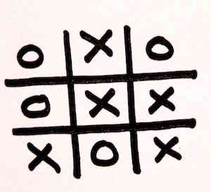

## Tic Tac Toe Analyzer

The goal of this app is to develop an application which takes a tic tac toe board, and outputs who the winner is (if any), or whether it is a draw.

### Problem

You have just taken over a project that was rushed out the door by the previous developer. It seems to behave correctly with a 3x3 board. Thankfully, it seems like the developer has left behind a test suite to cover what they had already developed.

### Your Goals

- Refactor the existing code to prepare it to work with a n x n board
- (BONUS) Currently the output is "draw", when there is no winner, and the game hasn't finished yet. Change this to say "unfinished" if the game hasn't been finished.

### Setup

    npm install

### Running tests

    npm test

### Notes

- The tests that run against a 5x5 board are in the test file, but are currently marked as `xdescribe` to prevent them from running. Change those to say `describe` once done to see whether they are passing
